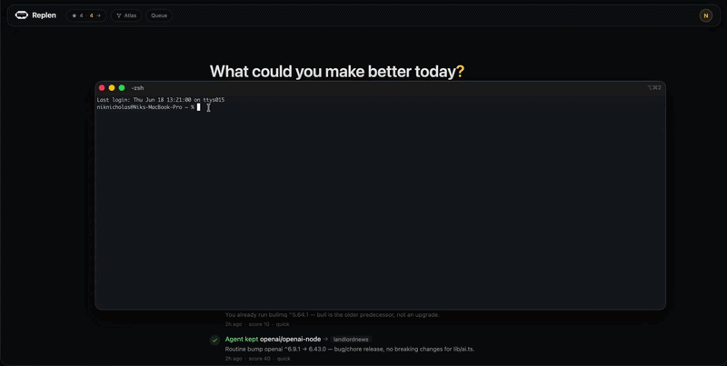
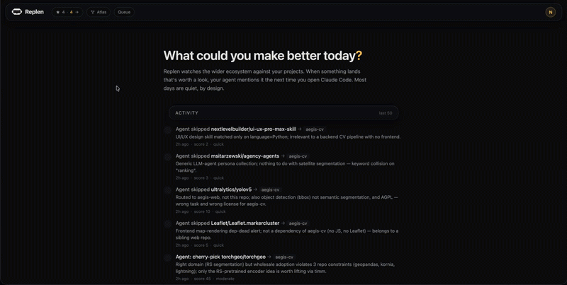

<div align="center">
  
  <h1>Replen</h1>
  <p><strong>Smarter AI Development Workflows</strong></p>
  <p>A local intelligence layer for AI coding agents.</p>

  <p>
    <a href="https://www.npmjs.com/package/replen"></a>
    <a href="https://www.npmjs.com/package/replen"></a>
    <a href="LICENSE"></a>
    <a href="https://replen.dev"></a>
    <a href="security/skillspector/SUMMARY.md"></a>
  </p>

  <p>
    <a href="https://replen.dev">Website</a> ·
    <a href="https://docs.replen.dev">Docs</a> ·
    <a href="#quickstart">Install</a> ·
    <a href="#workflow">Workflow</a> ·
    <a href="mcp/">MCP</a> ·
    <a href="skills/">Skill</a> ·
    <a href="#self-host">Self-host</a> ·
    <a href="https://replen.dev/research/">Research</a> ·
    <a href="https://app.replen.dev">app.replen.dev</a>
  </p>
</div>

<p align="center">
  <a href="https://replen.dev"></a>
</p>

---

Claude Code, Codex and Cursor already help inside the repo you are working on. Replen gives them a local intelligence layer across every repo you build.

It maps each project to what it actually does, building an ontology and knowledge graph of your portfolio: computer vision, geospatial analysis, market-making, scraping, workflow automation, or whatever else you build. It then watches the OSS ecosystem and continuously scores relevant projects against your real capabilities, using semantic matching and a self-tuning learning loop shaped by what you adopt, skip and review.

The result is not a trending list, a keyword search, or a static repo graph. Replen autonomously surfaces a small number of high-signal suggestions your AI coding tools can actually use.

Sometimes that means adopting a library as-is. Sometimes it means porting a function or algorithm from a larger project. Sometimes it means cherry-picking a technique, or clean-room building an idea from scratch to stay licence-compliant.

The judgement happens locally, inside your session, against your real code. Your code never leaves your machine.

Replen aims for a few useful suggestions a month. Most days it says nothing. When something real lands, your AI tool can mention it the next time you open the repo, as a short note at the end of its first reply:

> By the way, `D4Vinci/Scrapling` could help your scraper get past Cloudflare. Want the full review?

## Brainstem, Watchtower, Atlas

Replen has three parts, and they mostly matter together.

- **Brainstem** is the matching core. It knows what each of your repos does (per-capability embeddings, not keywords) and sources what fits: a library to use as-is, an algorithm to port, a technique to cherry-pick, an idea to clean-room build. It also flags when something does a job better than what you already have. Every verdict your agent records tunes the ranking, so what you adopt pulls it toward your taste and what you skip pushes it away.
- **Watchtower** is a maintained network of about 1,250 sources covering what your code relies on: releases, advisories, pricing pages, licences, standards, and end-of-life dates. Four questions gate it (will this break my app, is there a security issue, will my bill rise, do I need to upgrade), so a quiet day stays silent.
- **Atlas** is the knowledge graph of your dev world: projects, capabilities, tools, decisions, goals. It's built from Tiles, the linked markdown your agents read straight off disk. Brainstem learns from it; Watchtower's alerts land on it.

The loop: Atlas records what you build, Brainstem matches it against what Watchtower sees, your agent triages it in-session, and the verdict lands back in Atlas.

<p align="center">
  <picture>
    <source media="(prefers-color-scheme: dark)" srcset="assets/replen-system-dark.svg">
    
  </picture>
</p>

## Quickstart

Three steps: **install → onboard → use.**

### 1. Install: `npx replen`

```bash
npx replen
```

One command, ~60 seconds: signs you in (Google / GitHub / email link), asks **which repos to include** (all (the default), a subset, or none for now), and wires the [@replen/mcp](https://www.npmjs.com/package/@replen/mcp) server plus the `/replen` + `/replen-onboard` skills into Claude Code / Codex / Gemini. It also auto-extracts tags from each repo's manifests and drops a small "Replen integration" section into each included project's `CLAUDE.md` / `AGENTS.md`. No API key, no GitHub PAT, no manual project setup. (Repo discovery details and non-conventional-folder handling are in [How repo discovery works](#how-repo-discovery-works) below.)

### 2. Onboard: `/replen-onboard` (one-time)

Open Claude Code in your work and run `/replen-onboard`. The agent also **offers it automatically on your first session**, so you don't have to remember it. It reads each repo and builds a **grounded profile** (capabilities + a project report) so matches are relevant to what you actually build, not a generic trending list. Runs autonomously in the background; once per project. For deeper grounding you can opt in with `npx replen immerse`, which embeds your code content locally so only the vectors, never the source, leave your machine.

### 3. Use: just work

Carry on coding. `/replen` triages today's matches for the current repo (a verdict and effort estimate per candidate, against your code) and otherwise Replen drops a calm one-line note in your AI tool's reply when something genuinely fits. Silent on quiet days.

### How repo discovery works

Replen finds your projects by locating **git repos** (directories containing a `.git/`) with a **GitHub `origin` remote**. It looks for them in this order, stopping at the first that turns up repos:

1. A `--root <path>` flag you pass explicitly
2. The `REPLEN_PROJECT_ROOTS` env var (colon-separated dirs)
3. **Walk-up from the current directory**: if you run `npx replen` from inside a repo (or one of its subfolders), Replen finds that repo and scans its parent folder for siblings
4. Repos you've opened in Claude Code (`~/.claude.json`)
5. Conventional folders: `~/github`, `~/code`, `~/projects`, `~/dev`, `~/src`, `~/work`
6. An interactive prompt asking where your code lives

**If your code lives in a non-conventional folder** (e.g. `~/js stuff`, `~/work-2024`), the conventional-folder scan won't find it. Two easy fixes:

```bash
# Option A: run it from inside one of your repos, so the walk-up finds the folder:
cd ~/js\ stuff/my-project && npx replen

# Option B: point it at your folder explicitly (quote any spaces):
npx replen --root "~/js stuff"
```

Both work for the initial setup and for `npx replen sync-projects` later.

**What you do not provide:**
- ❌ OpenAI / Anthropic / DeepSeek API key: your AI tool handles the reasoning
- ❌ GitHub PAT: optional, only needed if you want server-side handoff PRs
- ❌ Manual project setup: auto-discovered from your local filesystem
- ❌ Per-project tag config: auto-extracted from manifests

For self-host: `REPLEN_BASE=https://replen.your-domain.dev npx replen`.

Subcommands: `replen sync-projects` · `replen status` · `replen inject` · `replen immerse` · `replen mcp setup` · `replen logout` · `replen uninstall` · `replen --help`.

**Backing out:** `npx replen uninstall` reverses every local change: the MCP wiring (Claude / Codex / Gemini), the installed skills, the per-repo `CLAUDE.md`/`AGENTS.md`/`GEMINI.md` integration blocks, and `~/.replen`. It asks before each category (nothing is removed without a yes; `--dry-run` previews). It only touches this machine. Your server-side profile is deleted separately from the dashboard.

## What it does

1. **Understands what your code does, then matches by capability.** Replen extracts each project's technical capabilities from its docs and dependencies (computer vision, geospatial, market-making, realtime streaming) and scores candidates against those rather than a generic trending list. Candidates come from a shared, capability-indexed library catalogue plus targeted search; the matching is what makes a suggestion fit your repo. It's mechanical and cheap, with no per-candidate LLM.

2. **Tells your AI tool when something landed.** A small session-start check returns up to 5 candidates per project. When you next open Claude Code or Codex in a tracked repo, your AI tool sees the candidate list in its opening context and mentions it after answering your first message. Silent on the days nothing is queued.

3. **The agent triages in-session.** Your AI tool reads each candidate's README, greps your local source for related code, runs a four-pass funnel (can we use this; do they do something we already do but concretely better; is there an idea worth keeping; does this sharpen what we're not), and forms a verdict: **adopt / port / cherry-pick / clean-room / upgrade / skip**, with a score and effort estimate, written up against concrete file references in your repo. Even a direct-use skip can bank a transferable insight (a lesson or a boundary) for later. There's no API key to give us and nothing to bill, because Replen runs no LLM on the server side. It all happens inside the session you're already in.

4. **You act on the keepers.** Star, hide, or open a handoff PR. These are captured server-side via `replen_state`, and the agent never re-surfaces what you've actioned. The PR step uses your existing `gh auth`, so there are no Replen-stored credentials.

## Watchtower

**Watchtower** is Replen's maintained source network: ~1,250 continuously-verified sources spanning vendor changelogs, security advisories, pricing pages, release feeds, standards trackers, and end-of-life calendars (self-hosted installs start from the committed seed catalogue and can point the same engine at their own lists). Six lenses run on it, each scored against your project's capabilities rather than a keyword list, and everything surfaces the same calm way: quietly, in your AI tool's next reply, only when there's something real.

- **🔭 Projects that fit a capability you have.** Scored against what your repo actually does. A CV library for your vision pipeline, a backtesting framework for your trading bot, an algorithm worth porting into a file you maintain. Drawn from a capability catalogue that sharpens with every project. *(See the example below.)*

- **🔒 Security in your stack: known advisories.** A new CVE in a dependency you use, mapped from your manifest to the public advisory database, gated to what you'd actually act on.
  > *By the way, a security advisory affects a dependency you use: `drizzle-orm` (CVE-2026-39356, HIGH: SQL injection).*

- **📦 Your stack: dependency releases.** When a vendor you actually depend on ships, you hear about it: `next`, `openai`, `prisma`, `viem`, `stripe`-class SDKs and ~20 more, matched against your `package.json` / lockfile so it's *your* dependencies, not a firehose.
  > *By the way, a dependency you use just shipped: OpenAI SDK v6.39.0.*

- **📜 The standards you implement: spec changes.** EIPs/ERCs for web3 code, TC39 stage advancements for JS/TS, Chrome Platform Status deprecations for frontends, matched to the standards your project actually touches.
  > *By the way, a standard your code implements just changed: ERC-5516.*

- **🩺 The health of what you build on: upstream risk.** A direct dependency gone stale or archived, a high-engagement bug others are hitting in one of your deps, or an active incident on a managed service you use (Vercel, Supabase, Cloudflare, …). When something IS dying, the same breath names maintained alternatives from the catalogue.
  > *By the way, an upstream you depend on needs attention: `request` looks dead (no push in 654 days). Maintained alternatives exist (`sindresorhus/got`).*

- **💷 The price of what you run on: pricing, licences, deadlines.** Plan-level price changes on ~280 dev-tool pricing pages (personalised when you've declared your tier: *"Supabase changed pricing on YOUR plan"*), licence flips (MIT→BSL/SSPL), and dated obligations: EOLs and deprecation deadlines tracked against your reported versions, with reminders at T-30 and T-7.
  > *P.s. python 3.10 reaches end-of-life on 31 Oct. Affects `acme-api` (3.10.12).*

Everything runs through one discipline: **silence beats a weak match.** If nothing clears the relevance bar, Replen says nothing, with no daily "by the way" noise. A brand-new project gets a wide first look (months of history); after that, the last week. The inventory also learns from how people triage: a candidate enough users judge rubbish stops being shown to anyone, while one that proves useful for a project like yours can surface to you too. That uses repo identity and aggregate signal only, never your code or anyone else's.

Manage which repos Replen watches (inclusion, tags, owner) at **[app.replen.dev/projects](https://app.replen.dev/projects)**.

## What a match looks like

Not a one-liner. Each match is a 400-900 word writeup with the same shape:

> **roboflow/supervision** · high · 87 · 38.7k★ · MIT · pushed 3d ago
>
> Reusable CV building blocks in Python: bounding-box drawing, mask compositing, video sinks, and a small set of trackers (ByteTrack + a Norfair adapter). Active: 11 PRs merged this week.
>
> For *my-cv-project* specifically, there are 3 concrete plug points where it earns its place. Listed in increasing ambition:
>
> 1. **Drop-in replacement for annotations.py.** Your current `BoxAnnotator` / `MaskAnnotator` wrap cv2 in ~180 lines; `supervision.Detections` + `supervision.BoxAnnotator` give the same surface plus label-collision handling and built-in confidence formatting. One file deleted, one import. ~30 min including a smoke test of the demo notebook.
> 2. **Replace trackers/byte.py with supervision.ByteTrack.** You vendored ByteTrack in May; supervision tracks upstream and ships the class-aware tracking fix from October. Drops ~600 lines plus the requirements pin. ~1h to wire up + verify the multi-class regression test passes.
> 3. **Use the video utilities** (`sv.VideoSink`, `sv.get_video_frames_generator`). You call `cv2.VideoCapture` / `VideoWriter` directly across 4 files; supervision wraps them with proper resource management and progress reporting. Less load-bearing than (1) and (2); only if you're already in that code path.
>
> Do (1) first: single PR, isolated blast radius, demonstrates the value before committing to the dependency. (2) only after (1) merges. Skip (3) unless you're already in the video path for something else.

The plug points reference your project's actual files because *your AI tool reads them in-session*. The shape is always: intro (what the repo is) → "For PROJECT specifically, N plug points" bridge → numbered plug points naming real files / modules → scoping paragraph telling you the smallest first move.

## Comparing against what you've already built

Most discovery tools only fill gaps: they find a thing you don't have. Replen also looks at what you've already built and checks whether there's a better way to do it.

When a capability you already cover has a concretely better option in the ecosystem, Replen surfaces it even though the gap is "filled":

- **A better library.** Your scraper retries naively; another defeats Cloudflare via TLS-fingerprint rotation.
- **A better algorithm.** You triangulate detection on a single video feed; another fuses video and audio.
- **A better practice.** A structural move another project makes that yours doesn't.

The bar is high: a named, specific improvement, not "this also looks good". A vague "you could improve here" stays silent. It rides the same cadence as everything else, surfaced quietly in your AI tool's next reply, only when the win is real and concrete.

This judgment isn't pattern-matching on stars or buzz. It's grounded in a **capability ontology** Replen maintains: a structured map of capabilities, the tools and approaches that fill each one, and *better-than* relationships scoped to a task: X beats Y *for this job*, not in the abstract. That structure is what lets Replen make a specific, defensible "there's a better way" call instead of a vague nudge.

## Atlas

Discovery brings the outside world in. Atlas is the other half, a living map of everything you have already built and the connections inside it.

<p align="center">
  <a href="https://app.replen.dev/atlas"></a>
</p>

As Replen grounds each repo it draws them all into one graph. Every project, the capabilities inside each one, the candidates you have triaged, and how they relate. It is rebuilt on every run and derived entirely from the capability profiles your agent already writes, so it stays current on its own and your source is never part of it. Atlas has two halves. The graph is what you explore, and three things ride on it: Leaps, Recall, and the themes and keystones it surfaces. Carts are the other half, browsable and filterable views over the same decision graph.

<p align="center">
  <picture>
    <source media="(prefers-color-scheme: dark)" srcset="assets/atlas-full-dark.svg">
    
  </picture>
</p>

- **Leaps** (`replen_leaps`). Connections across your own work that you would never go looking for. A thing you solved cleanly in one repo is the open gap in another. A capability in one project answers a problem in a project you have not opened in months. Each leap is scored on relevance and surprise, and comes with the path that explains it. Your own portfolio becomes a source, not just the ecosystem.
- **Recall** (`replen_recall`). In-session memory over your past triage decisions and capabilities. Ask what you have ported, whether you have weighed something before, or which repo already does a thing, and the agent answers from your real history instead of guessing.
- **Themes and keystones.** Capabilities clustered into themes, with the load-bearing keystones that recur across projects flagged. A quiet read on what your work is made of, plus provenance on every capability (grounded / extracted / inferred) so matching trusts solid signal over soft guesses.
- **Carts** (`replen_cart`). The graph's other half: browsable, filterable views over the decision graph, pulled straight into a session or opened in the webapp, so a question like *what have I deferred* or *where are my blind spots* becomes a list you can act on.

See it as an interactive graph at [app.replen.dev/atlas](https://app.replen.dev/atlas): explore it in 3D, watch it cluster by domain, click any edge for why it's there, and open any node's **dossier** (the legible decision log for that capability or candidate). The same page opens **Carts**, filterable views over the graph, in six built-in cuts (Blind spots, Triage board, Keystones, Brought in, Stale deferrals, By domain) and five layouts (Table, Board, Cards, Map, Timeline): drag a card to a verdict column on the Board and it writes back to the graph as an evaluated edge, the Map is a PCA scatter of the same rows, and any cut you tune can be saved as a custom cart. Or run `replen atlas` to write the whole map to `~/.replen/atlas/` as **Tiles**, linked markdown notes that stitch together (open the folder in Obsidian for the graph view).

Atlas tiles double as a **memory layer for your coding agents**: plain markdown on disk, kept fresh in the background by the MCP server, and any agent in any repo can read `~/.replen/atlas/MAP.md` for cross-project context (what you've built, what fills each capability, and every decision with the reason) without an API call. The same memory feeds the daily loop itself: candidates arrive annotated with your prior verdicts ("you already cover this with X"), repos you deferred come back for a re-check once they mature, and on quiet days Replen surfaces one leap from your own portfolio instead of silence.

### Bring your knowledge graph (Graphify · Obsidian · ADRs)

Replen deliberately doesn't map your code's internals; it **ingests whatever already does**. If a repo carries a **Graphify** vault, an **Obsidian** vault, or `docs/adr/` decision records, the onboarding agent uses them as its grounding source: entity notes become grounded capabilities, note bodies become descriptors, and the files they link become evidence anchors. That's faster and richer than a cold code-read, and the deep graph stays where it lives. Your Graphify graph makes Replen's matching smarter; Replen makes your graph actionable. Privacy is unchanged: only capability specs, paths, and tags ever leave your machine, never vault content or code.

Vaults are auto-detected inside the repo (`graph/`, `vault/`, `.graphify/`, `docs/adr/`). If yours lives **elsewhere** (a central Obsidian vault for everything, or a Graphify graph kept outside the repo), point Replen at it:

```bash
npx replen vault ~/ObsidianVault          # a vault that covers all your repos
npx replen vault me/drone=~/graphs/drone   # a vault scoped to one repo
npx replen vault --list                    # show what's configured
```

Then re-run `/replen-onboard` and the agent grounds from it. (`--vault PATH` also works inline on `npx replen` and `npx replen sync-projects`.)

## Research

The core idea behind Replen, scoring a candidate against your *whole portfolio* rather than just the repo in front of you, turns out to be measurable.

A single-repo similarity has a failure mode. A library that *fills a gap* is, by definition, less similar to your current code than one that duplicates what you already have, so a per-repo matcher quietly prefers the redundant candidate. In a held-out benchmark, ranking novel-vs-already-covered candidates by single-repo similarity scored **AUC 0.415** (worse than chance) and adding a portfolio prior derived from your other repos lifted it to **0.862** (Cohen's *d* = 1.94, *p* < 0.001). It's the same prior that powers Brainstem's down-ranking and [Atlas](#atlas)'s Leaps.

This is an applied result, a real failure mode and a fix grounded in private cross-repo signal, the suppression arm is strong, while surfacing the genuinely novel candidate to the top stays hard.

[Read our paper here](https://replen.dev/research/).

## Numbers

Things we measure, not claims we promise.

- **Free.** Replen runs no LLM on the server side, so there's nothing to bill. Everything runs inside the session you're already in.
- **A few actionable matches a month, per project.** The target cadence, and what we see in testing. Open more sessions and you'll see more, but the bar stays the same. Only things worth acting on.
- **~50 ms** for the session-start `replen check-new --hook` ping. Cursor-based, so it only sees what's new since the last call.
- **~20-90 s** to triage one candidate in-session. The agent reads the README, greps your code, and writes the verdict.

## Workflow

```
1. Server-side fetcher pulls candidates           → from the catalogue + targeted search;
                                                    eligibility filter drops aggregators /
                                                    archived / dups
2. You open Claude Code / Codex in a repo         → SessionStart hook + CLAUDE.md instruction
                                                    surfaces "N new matches" in opening context
3. Your AI tool mentions them after your prompt   → "by the way, 2 new Replen matches landed..."
4. You ask for triage                             → "show me the top one"
5. Agent invokes the /replen skill                → reads READMEs, greps your local code,
                                                    forms verdict (adopt/port/upgrade/skip…) with score
6. You star, hide, or hand off                    → replen_state captures it server-side;
                                                    agent never re-surfaces what you actioned
7. Optional: open a handoff PR                    → markdown briefing in .replen/handoffs/;
                                                    next agent reads it, proposes the diff
```

The handoff briefing (committed to your repo, not ours) covers: why this candidate fits *your project specifically*, which files in your codebase to touch, suggested feature-flag rollout, integration risks, what to keep out of scope. Replen is research + dispatch; never the one writing code into your repo.

Concrete example of a briefing: see [replen.dev](https://replen.dev#the-handoff-loop).

## Architecture

```
─── INGESTION (server-side, mechanical, no LLM) ──────────────
  capability-indexed catalogue       ─┐
  targeted search (per-project caps)  ├─→  candidates  (sqlite)
  curated ecosystem signals           │     + eligibility filter
  /api/ingest (bookmarklet / POST)   ─┘      (drop archived /
                                              aggregator / dup)
                                        ↓
─── ELIGIBILITY + RANKING (mechanical) ───────────────────────
    ├─ dedup (the same repo often surfaces twice)
    ├─ rank, sharpened by aggregate feedback
    ├─ per-project diversity cap (max 6 visible / project / window)
    └─ persist with discovery mode tag (scouted / discovered / re-checked)
                                        ↓
─── DELIVERY ─────────────────────────────────────────────────
  → @replen/mcp (stdio, 15 tools)
       ↑    replen check-new (hook) → "N new" surfaced in session
       │    replen_match            → curated inventory scoped to open repo
       │    replen_state     → star / hide / handoff captured
       │
  ┌────┴─────────────────────────────────────────────────────┐
  │  /replen skill (Claude Code playbook)                    │
  │    - WebFetches each candidate's README                  │
  │    - Greps the user's local code                         │
  │    - Forms verdict (adopt/port/upgrade/skip…) + writeup  │
  │    - All reasoning inside the user's own session         │
  │    - Replen never sees source code                       │
  └──────────────────────────────────────────────────────────┘
  → SessionStart hook       (npx replen check-new --hook, ~50ms)
  → handoff PR mechanism    (GitHub REST API, optional PAT)
  → high-relevance webhook  (Slack / Discord, optional)
  → Webapp                  (Next.js, Firebase Auth: settings + history viewer)
```

## Local dev

```bash
git clone https://github.com/replenhq/replen.git && cd replen
cp .env.example .env   # fill in keys (see below)
npm install
npm run db:generate
npm run db:migrate
npm run dev            # dashboard at http://localhost:3030

# one-shot pipeline run
npm run pipeline:run
```

Required `.env` keys for local:

| key | what for |
|---|---|
| `ENCRYPTION_KEY` | base64 32-byte key for at-rest secret encryption (used for the optional GitHub PAT). Generate with `openssl rand -base64 32` |
| `FIREBASE_PROJECT_ID` / `FIREBASE_CLIENT_EMAIL` / `FIREBASE_PRIVATE_KEY_BASE64` | service account for Firebase Auth |
| `GITHUB_TOKEN` | only used by tests; user PATs (optional, for handoff PRs) drive real runs |
| `SYNC_TOKEN` | random string, gates the laptop `/api/sync` CLI |

No LLM provider keys are required; reasoning happens client-side in the user's AI tool session, not on the server. See `.env.example` for legacy / opt-in extras (e.g. webhooks).

## Self-host

Runs on any Linux server or your local machine: Node.js + sqlite. Two long-running processes:

- `replen.service`: Next.js webapp (settings + history) on `127.0.0.1:3030`
- `replen-cron.service`: node-cron scheduler that periodically fetches source feeds, applies the eligibility filter, and updates the candidate inventory. Mechanical work, no LLM calls.

The included `scripts/deploy.sh` rsyncs the repo to a target host, installs systemd units, and reloads. It is one possible layout; you can swap in any process manager (PM2, supervisord, Docker, a launchd plist on macOS) and any reverse proxy (nginx, Caddy, Traefik) without touching the app. Front it with whatever TLS you already use.

```bash
# populate .env on the remote first (chmod 600); secrets never go through rsync
DEPLOY_HOST=your-ssh-alias \
  ./scripts/deploy.sh
```

Env knobs the deploy script respects (all optional, defaults shown):

| var | default | what |
|---|---|---|
| `DEPLOY_HOST` | `replen-host` | SSH alias for the target host |
| `DEPLOY_DIR` | `/opt/replen` | Remote install dir |
| `DEPLOY_USER` | `ubuntu` | Remote user owning the dir |
| `SERVICE_PREFIX` | `replen` | Systemd unit name prefix |
| `DEPLOY_NGINX_SITE` | `replen.conf` | reverse-proxy sites filename (if you use nginx) |
| `DEPLOY_NGINX_TEMPLATE` | `nginx-replen.conf` | template file inside `scripts/` |
| `DEPLOY_LOG_DIR` | `/var/log/replen` | Remote log dir |

The script excludes `.env`, `node_modules`, `.next`, `data`, and `.git` from rsync, then runs `npm install` + migrations + build remotely. You manage `.env` on the target manually so secrets never transit through your laptop sync.

To warm the watch lenses on a fresh install, import the starter seeds (security aggregators + ~20 well-known vendors' changelogs/releases, ~30 pricing pages):

```bash
tsx src/cli/import-announcement-sources.ts seeds/starter-announcement-sources.json
tsx src/cli/import-pricing-tracker.ts seeds/starter-pricing.json
```

Both importers accept any file in the same shape; point them at your own curated lists to extend coverage. See `seeds/README.md`.

## Surfaces

The product is the **skills + MCP**, running inside your Claude Code / Codex session. The webapp is a settings UI for configuring them and a history viewer for browsing what surfaced over time. Optional, the skills work whether you ever sign in or not.

### Skills

`/replen-onboard` is the one-time setup sweep. Run it once and your agent works through your active repos in the background, reading each one's code, tidying thin or missing docs (never touching good ones), and building a grounded profile of what each repo really does. That profile is what makes matches fit your code instead of its keywords.

`/replen` runs the in-session triage. List new candidates via the MCP, read each candidate's README, grep your local code, form a per-candidate verdict (adopt / port / cherry-pick / clean-room / upgrade / skip) with a writeup grounded in real file paths in *your* repo. Invoke it explicitly with `/replen`, or let the agent invoke it when the session hook surfaces "N new matches." `npx replen` installs both skills into `~/.claude/skills/` for you.

The MCP gives the agent **tools** (data access); the skill gives it a **playbook** (when to call what, in what order, how to write the verdict). Domain-volatility split per [LlamaIndex's skills-vs-MCP article](https://www.llamaindex.ai/blog/skills-vs-mcp-tools-for-agents-when-to-use-what).

### MCP server (`mcp/`)

Self-contained npm package (`@replen/mcp`) that exposes 15 tools to Claude Code / Codex / any MCP host. Grouped by role:

| Role | Tool | Returns |
|---|---|---|
| **Triage flow** | `replen_match` | Today's curated inventory scoped to the open repo. Returns candidates + the footnote line + any keystone upgrades and queued actions; the skill triages each against the local codebase |
| | `replen_state` | Capture user actions: star / unstar / hide / handoff |
| | `replen_record_triage` | Persist the agent's verdict (adopt / port / cherry-pick / clean-room / upgrade / skip + score + effort) back to Replen |
| **Atlas & memory** | `replen_leaps` | Leaps. Surprising connections across your own Atlas, a capability in one repo that fills a gap in another, each scored and explained by the path that links them |
| | `replen_recall` | Recall. In-session memory over your past triage decisions and capabilities; answers what you have ported, weighed before, or already build elsewhere |
| | `replen_cart` | Pull a saved or built-in Atlas Cart's rows in-session (Blind spots, Triage board, Keystones, Brought in, Stale deferrals, By domain, or your saved carts) |
| | `replen_capture_insight` | Bank a transferable insight from triage's generative-skip lane, a borrowed premise (a `lesson`) or a sharpened `boundary`, even when the candidate itself is a direct-use skip |
| | `replen_queue` | The awareness→action queue: items parked from the weekly Brief / alerts ("queue for next session"). `replen_match` surfaces the oldest and offers to act on it |
| **Configuration** | `replen_set_capabilities` | Set a project's grounded capabilities (tag + descriptor + data modality) and report, so matching fits the code from day one |
| | `replen_set_tags` | Set a project's broad domain tags from the in-session agent |
| | `replen_set_versions` | Report pinned dependency/runtime versions (names + versions only, never code), so EOL / CVE / brief alerts get specific, and alarms suppress for versions you're verifiably not on |
| | `replen_set_product` | Group several repos as one product, so their capabilities are unioned when you work in any of them |
| | `replen_onboard_state` | Per-repo onboarding state for the whole portfolio: the cheap pre-flight for `/replen-onboard`, so it does the minimum work per repo instead of re-reading every codebase |
| **Actions** | `replen_handoff` | Opens a handoff PR for a starred match |
| **Discovery** | `replen_help` | Tool-discovery list; useful when bootstrapping the connection |

The dashboard owns the browse/search surface (recent matches, full-text search, starred, run status); the in-session agent uses `replen_match` for surfacing, so those aren't exposed as agent tools.

**Install:** `npx replen` (OAuth flow + wires this into Claude Code in one command; see Quickstart above).

To install the MCP only (skip the auth flow), or to wire it into a host other than Claude Code, add the entry by hand:

```jsonc
{
  "mcpServers": {
    "replen": {
      "command": "npx",
      "args": ["-y", "@replen/mcp"],
      "env": {
        "DIGEST_BASE_URL": "https://app.replen.dev",
        "DIGEST_TOKEN": "ing_…"
      }
    }
  }
}
```

Token from `/settings` → "Connect Claude Code".

### Webapp (optional)

Settings UI for the skill/MCP and a history viewer for past matches. Use it when you want to tweak per-project tags, browse what surfaced over the last month, or check on a handoff PR's status. Everything else surfaces in-session, so you can ignore the webapp entirely if you live in Claude Code.

| Route | Purpose |
|---|---|
| `/` | History view: past matches project-grouped, with star/hide/handoff state |
| `/starred` | All starred matches bucketed by handoff state (awaiting / open PR / integrated) |
| `/integrated` | Wall of merged work; proof of what actually got shipped |
| `/search` | Full-text across writeups, repo metadata, personal notes |
| `/projects` | Per-project settings: sensitivity, GitHub repo binding, per-project tags + filter-mode |
| `/sources` | Per-user source handles + curated source proposals |
| `/runs` | Ingest run history; per-source breakdown (candidates surfaced + 👍/👎 net) |
| `/settings` | Ingest token, MCP install snippet, bookmarklet, webhook (optional), maintenance |
| `/admin` | Review and approve curated source proposals queued up from any account on the instance |

Keyboard shortcuts on `/`: `j/k` navigate matches, `s` star, `h` hide, `/` focus header search, `?` show hint.

## Sources

Candidates come from a capability-indexed catalogue, targeted search derived from each project's capabilities, and a curated set of ecosystem signals. They're deduped, filtered for eligibility (archived, language-mismatched, and aggregator repos are dropped), and ranked. The ranking sharpens from aggregate, anonymous feedback on what people keep and skip, so what reaches you improves over time.

The hosted instance runs the warm, cross-user catalogue and ranking. A self-host starts cold and builds its own.

## Server-side pipeline (per user, per run)

The server runs a small periodic job (cron, configurable interval) that maintains the candidate inventory. Mechanical work, no LLM calls anywhere on the server side.

1. **runFetchers**: pull candidates from every configured source, dedupe by `(source, source_item_id)`, persist with `userId`.
2. **eligibility filter**: drop aggregators, archived deps, language mismatches, cross-source duplicates. Tags candidates at insert with language + topics + repo-shape.
3. **rank**: per-capability cosine, calibrated and IDF-weighted, then sharpened by a learned outcome prior (what projects like yours actually kept vs skipped). Capabilities you already cover get down-ranked unless a keystone upgrade beats them.
4. **diversity cap**: MMR diversity on a per-project visible cap (default 6 / project / window) so noisy weeks don't drown the signal.
5. **sendHighRelevanceWebhook** (optional): POST to Slack/Discord/generic if any new `relevance=high` matches.

The agent's verdicts (adopt / port / cherry-pick / clean-room / upgrade / skip) come in later, via `replen_record_triage` from your AI tool's in-session triage. They're persisted alongside the candidates for browsing on the webapp.

Encrypted at rest (AES-256-GCM, per-account DEK envelope, keyed off `ENCRYPTION_KEY`): the optional user PAT used for handoff PRs, and the optional webhook URL. No LLM keys are stored because none are needed.

## Repository layout

```
replen/
├── src/
│   ├── app/                Next.js dashboard + API routes
│   │   └── api/
│   │       ├── mcp/        token-auth MCP endpoints (today/search/starred/analyze/handoff/feedback)
│   │       ├── ingest/     bookmarklet POST endpoint
│   │       ├── sync/       laptop CLI sync
│   │       └── whoami/     auth diagnostic
│   ├── analyzer/           triage + reason + writeup pipeline
│   ├── fetchers/           one module per source
│   ├── scheduler/          cron + per-user pipeline runner
│   ├── scanner/            safety scan (postinstall / secrets / metadata)
│   ├── email/              digest HTML + webhook
│   ├── lib/                crypto, github-pr, github-repo-detect, source-rank, pricing
│   ├── db/                 drizzle schema + migrations
│   └── cli/                one-shot CLIs (sync, backfill, redetect)
├── cli/                    `replen` CLI (the `npx replen` one-liner)
├── mcp/                    @replen/mcp MCP server package
├── skills/                 Claude Code skills
│   └── replen-match/       in-session match triage protocol
├── scripts/                deploy.sh, nginx config, systemd units, plists
└── data/                   sqlite db (gitignored)
```

## License

Apache License 2.0. See [LICENSE](LICENSE) for details.

## Credits

Replen was built by [@nsokin](https://github.com/nsokin) and the community.

- [replen.dev](https://replen.dev) · site
- [docs.replen.dev](https://docs.replen.dev) · docs
- [app.replen.dev](https://app.replen.dev) · hosted dashboard
- [@replenhq](https://github.com/replenhq) · GitHub org
- [@nsokin](https://github.com/nsokin) · maker

